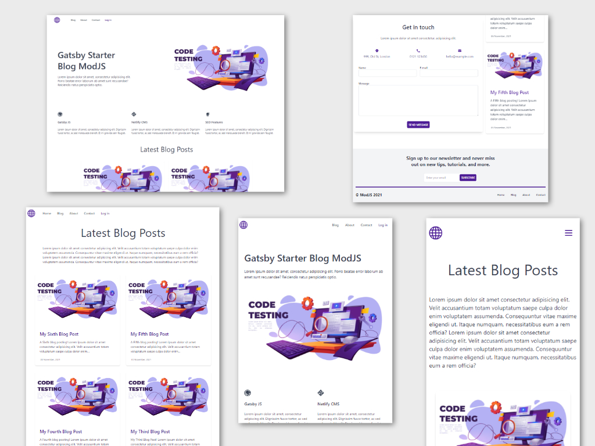

# Gatsby Starter ModJS Blog



## [Demo site can be seen here...](https://gatsby-starter-modjs-blog-demo.netlify.app/).

## Highlights

+ Gatsby
+ gatsby-plugin-image
+ Markdown
+ Netlify CMS
+ Tailwind CSS
+ SEO
+ 100% Lighthouse Score
+ Blog Pages
+ Create Additional Pages
+ Netlify Forms (Contact & Subscription)

## Create a Gatsby Site from this Starter

Use the Gatsby CLI to clone this starter, install it if not already installed.

`gatsby new gatsby-starter-modjs-blog https://github.com/mod-js/gatsby-starter-modjs-blog/`

`cd gatsby-starter-modjs-blog-demo`

Start the site on the development server by running `gatsby develop` or `npm run develop`

Your site is now running at http://localhost:8000

Running `npx netlify-cms-proxy-server` will allow you to loginto the CMS locally using Netlify proxy server.

http://localhost:8000/admin

## Open project and modify if required

Using VSCode

`code .`

## Deploying to Netlify and using Netlify CMS

If you used the `gatsby new` command rather than cloning and `npm init`, your site will have built the `public` folder for deployment.

If not, use `gatsby build` or `npm run build`

Run `gatsby serve` or `npm run serve` and test your production build at http://localhost:9000

### Push code to your repo

Create a new git repository.

Within your project folder initialise git and push the code to your repo.

```shell
git init
git add .
git commit -m "first commit"
git remote add origin https://github.com/<YOUR_ACC>/<YOUR_REPO>
git push -u origin master
```
### Setup Netlify

Sign into netlify or create a new account if you don’t have one.

Select create new site from Git.

Connect to Git provider GitHub.

Authorize Netlify to connect to your repo.

Deploy Site!

Select your site in Netlify and enable Identity.

Within the Identity settings section "Enable Git Gateway".

Within Identity settings edit "Registration preferences" select "Invite Only" and save.

Create a new user using the "Invite Users" action within Identity.

You will receive an email to accept the invitation and set a password.

Your site is now live and published on the URL given by Netlify, this can be changed, or you can add a custom domain name. You can also access the CMS via the login links from the new website.

Enjoy!
